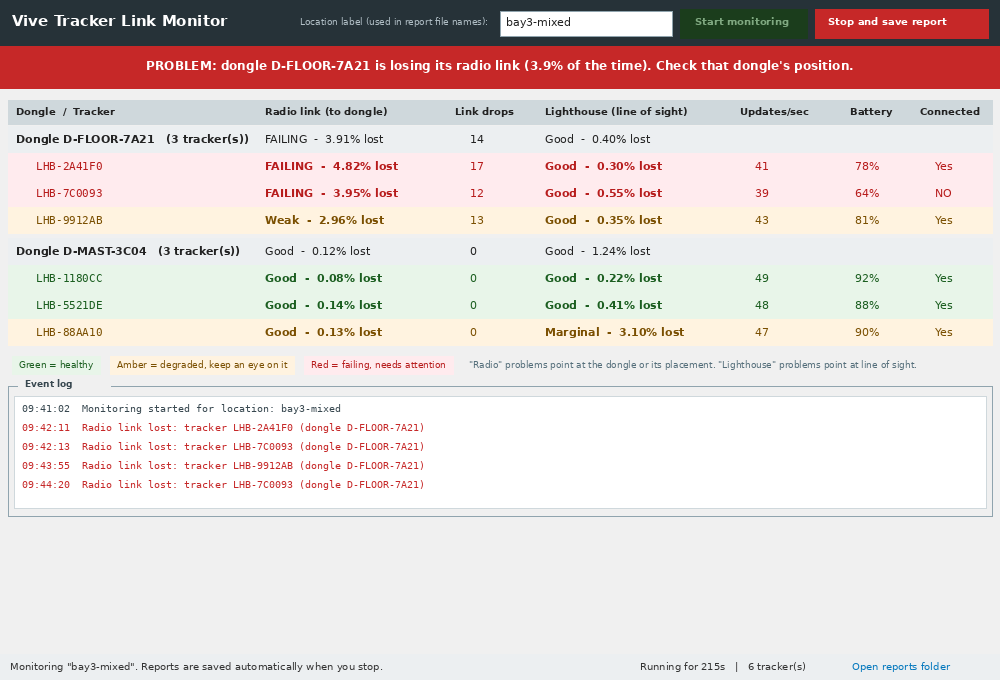

# Vive Tracker Link Monitor

Diagnostic tool for teleoperation rigs that use HTC Vive trackers with
SteamVR. It separates the two ways a tracker can fail and reports them
independently, per tracker and per USB dongle:

1. **Radio (dongle) problems** - the tracker's 2.4 GHz packets are not
   reaching its USB dongle (poor dongle placement, ground attenuation, body
   shielding, USB 3.0 interference, RF congestion).
2. **Optical (lighthouse) problems** - the tracker cannot see the base
   stations (occlusion, range, reflections).

> **New here?** See the step-by-step [How to use](docs/HOW_TO_USE.md) guide
> (with screenshots).

Most tracker health monitoring only covers the optical side. This tool
instruments the radio side as well, and because every tracker reports the
serial number of the dongle it is paired with, dropouts can be aggregated and
ranked per dongle. That ranking makes placement problems (for example a
dongle left on the floor) directly visible in the data.

## Method

All measurements come from SteamVR through the OpenVR API; no extra hardware
or drivers are needed.

| Signal (per tracker, per sample)                | Interpretation                  | Attributed to |
| ----------------------------------------------- | ------------------------------- | ------------- |
| `bDeviceIsConnected == false`                   | radio link down                 | dongle / RF   |
| connected, input packet counter stops advancing | radio starvation (soft)         | dongle / RF   |
| connected, `TrackingResult_Running_OutOfRange`  | cannot see base stations        | lighthouse    |
| `Prop_ConnectedWirelessDongle_String`           | dongle the tracker is paired to | -             |

Optical loss is only counted while the radio link is up, so the radio and
optical figures never overlap: if the link is down, the loss is attributed to
RF, not to the lighthouses.

## The GUI

`vive_dongle_gui.exe` is the recommended front-end. Layout, top to bottom:

- **Status banner** - one line, always answering "is anything wrong right
  now": green (all radio links healthy), amber (a dongle shows a weak link),
  red (a dongle is failing, named in the banner).
- **Table** - trackers grouped under the dongle they are paired with,
  colour-coded per row. Every row carries two independent verdicts side by
  side, each with the percentage of time lost: "Radio link (to dongle)",
  e.g. `FAILING - 4.82% lost`, and "Lighthouse (line of sight)", e.g.
  `Good - 0.30% lost`, plus radio drops, update rate, battery and link state
  (Up/Down). Radio drops count full losses of the dongle link, so they belong
  to the radio side, never the lighthouse side.
- **Legend** - explains the colours and the radio/lighthouse distinction.
- **Event log** - timestamped link-loss events as they happen.
- **Status bar** - elapsed time, tracker count, "Open report" and
  "Open reports folder" buttons.



In the example above the three trackers on dongle `D-FLOOR-7A21` show high
radio loss and many link drops while the three on `D-MAST-3C04` are healthy -
the pattern that indicates a dongle placement problem rather than a
lighthouse problem.

A console version (`vive_dongle_monitor.exe`) provides the same measurements
with CLI flags for scripted or timed runs.

## Outputs

All files are written to a `logs\` folder created next to the executable.

1. **Summary window** - opens automatically in the app when monitoring is
   stopped: a colour-coded conclusion banner, the per-dongle ranking (worst
   radio link first), a recommendation when one dongle stands out, and a
   per-tracker table.
2. **Text report** - `logs/<site>_<timestamp>_report.txt`, the same content
   as the summary window in plain text. Open it with the GUI's
   "Open report" button or with any text editor;
   `docs/sample_report.txt` shows an example.
3. **CSV time series** - `logs/<site>_<timestamp>_series.csv`, one row per
   tracker per second. For Excel, pandas or Grafana (see below).
4. **Event log** - `logs/<site>_<timestamp>_events.log`. Every radio drop
   (`DROP:`) and recovery (`RECONNECTED:`) is written here with a full
   timestamp and the tracker/dongle involved, so it doubles as a timeline of
   exactly when each link went down and came back. The text report is
   appended at the end.

### Importing into Grafana

The CSV is designed to drop into Grafana (CSV or Infinity data source) so
link health can be compared against other robot metrics:

- Every row carries both an ISO-8601 `timestamp` and a numeric `epoch_s`
  (Unix seconds) column.
- `tracker` and `dongle` columns work as label/series dimensions.
- The `*_1s` columns (`rf_down_pct_1s`, `optical_oor_pct_1s`, `drops_1s`,
  `stalls_1s`) are per-interval values - graph these to see spikes and
  correlate them with events elsewhere. `connected` is a 0/1 state flag.
- The `*_total` columns are cumulative since the start of the run and suit
  end-of-run comparisons rather than time-series panels.

## Build

The target SteamVR PC does not need internet access: the executable only
talks to the local SteamVR process. Build once, copy the result across.

PyInstaller does not cross-compile, so the `.exe` must be built on Windows.
Two ways to do that:

**Option A - GitHub Actions (works from a Mac).** Every push to this
repository builds both executables on a Windows runner. On GitHub open
*Actions* -> *Build Windows executables* -> latest run -> download the
`vive-link-monitor-windows` artifact (a zip containing both `.exe` files).
The workflow can also be started manually with *Run workflow*.

**Option B - any Windows machine with Python 3.9+ and internet:**

```bat
build_exe.bat
```

Either way you get two standalone files:

- `dist\vive_dongle_gui.exe` - windowed version (recommended)
- `dist\vive_dongle_monitor.exe` - console version with CLI flags

The `openvr` wheel bundles `openvr_api.dll`, and PyInstaller's
`--collect-all openvr` packs it into the executable, so nothing needs to be
installed on the target machine.

## Run on the SteamVR PC

1. Copy the `.exe` to the PC (USB stick, file share, or any file transfer).
2. Start SteamVR; confirm the trackers are powered on and tracking.
3. Double-click `vive_dongle_gui.exe`.
   - Windows SmartScreen may warn because the binary is not code-signed:
     choose "More info", then "Run anyway".
   - If a Windows Firewall prompt appears it can be denied; the tool makes
     no network connections.
4. Enter a location label (for example `bay3-floor`) and press
   **Start monitoring**.
5. Run for a representative period while the equipment is in normal use.
6. Press **Stop and save report**. The summary window opens and the CSV and
   event log are written to a `logs\` folder next to the executable.

Console version:

```bat
vive_dongle_monitor.exe --site "WarehouseA-bay3" --duration 300
```

Flags: `--site` (run label), `--duration` (auto-stop after N seconds, 0 =
until Ctrl+C), `--log-dir` (output directory, default `logs\`), `--no-log`
(console only).

With Python and the `openvr` package installed, both front-ends also run
from source: `run_from_source.bat --site test`.

## Comparing dongle placements

To test a placement hypothesis, hold everything else constant and change
only the dongle position between two runs:

1. Baseline: dongles in their current position. Run for a fixed window with
   representative motion, e.g. `--site "bay3-FLOOR" --duration 300`.
2. Treatment: move the dongles (for example onto USB extensions, 1.5-2 m
   high, clear of metal and the floor). Repeat the same motion with
   `--site "bay3-ELEVATED" --duration 300`.
3. Compare the two CSV files (radio loss %, link drops, stalls). Higher
   radio loss in the baseline with similar optical loss indicates the
   dongle placement, not the lighthouses, is the cause.

Alternatively run a single mixed session with dongles in different positions;
the per-dongle ranking in the summary makes the comparison directly.

## Common radio-side causes worth checking

- **USB 3.0 interference.** USB 3.0 ports, cables and hubs radiate broadband
  noise in the 2.4 GHz band and are a frequent cause of dongle dropouts.
  Prefer USB 2.0 ports and shielded extension cables, away from USB 3.0
  cabling and external drives.
- **Floor placement** combines ground attenuation, multipath and body
  shielding whenever an operator or robot passes. Mounting dongles at
  roughly tracker height with line of sight is preferable.
- **Dongle spacing.** Dongles placed close together desensitise each other.
  HTC's guidance is at least 0.3 m apart; avoid stacking them in one hub.
- **2.4 GHz congestion.** Many trackers plus Wi-Fi and Bluetooth in one room
  raise the noise floor. RF shielding between cells helps only if it
  actually sits between the radio paths.
- **Battery and contacts.** Low battery or dirty pogo contacts cause link
  drops; the tool reports battery percentage per tracker.
- **Pairing.** Confirm each tracker is paired to a nearby dongle rather than
  one across the room; the dongle column shows the actual pairing.

## Files

| File                      | Purpose                                            |
| ------------------------- | -------------------------------------------------- |
| `vive_dongle_gui.py`      | GUI front-end (tkinter, standard library)          |
| `vive_dongle_monitor.py`  | console front-end                                  |
| `vive_rf_core.py`         | sampling engine, statistics, logging, summary      |
| `build_exe.bat`           | builds both executables                            |
| `run_from_source.bat`     | run from source on a development machine           |
| `requirements.txt`        | `openvr` (runtime), `pyinstaller` (build)          |
| `docs/gui_preview.png`    | screenshot used above                              |
| `docs/sample_report.txt`  | example of the saved report                        |

## Naming trackers

Vive trackers are identified by serial (e.g. `LHB-7C0093`). To show friendly
names instead, the tool writes a `tracker_names.csv` next to the executable
the first time it sees your trackers, listing each serial with a blank name:

```
serial,name
LHB-7C0093,
LHB-2A41F0,
```

Fill in the names (e.g. `LHB-7C0093,Robot-3 waist`), save, and on the next run
the names appear in the table, the report and the CSV (`tracker_name` column).
Edit the file any time; it is read at the start of each run.

## Notes

- The input packet counter is a host-side indicator of radio starvation; it
  is a relative measure, not a calibrated packet count. Hard link drops
  (`bDeviceIsConnected`) are the authoritative radio signal and are what the
  summary ranks dongles by.
- The tool connects to SteamVR as a background application and does not
  interfere with a running teleoperation session.
- Works with Vive trackers (1.0/2.0/3.0) and controllers.
