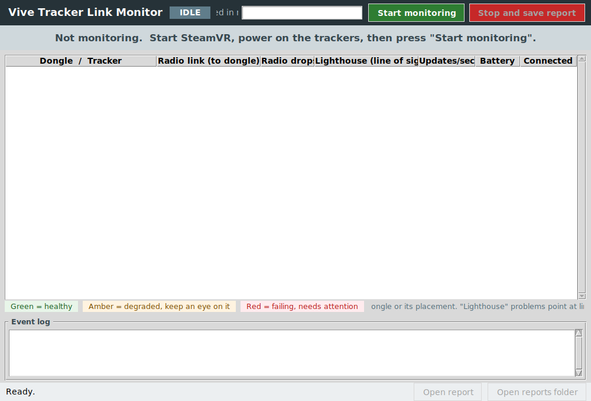
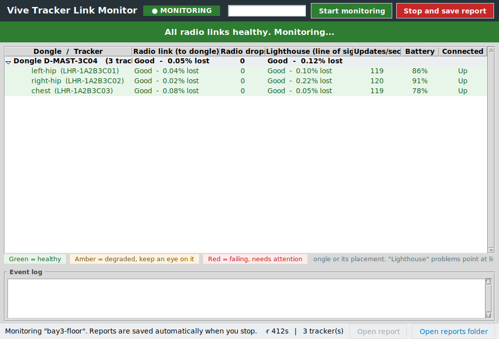
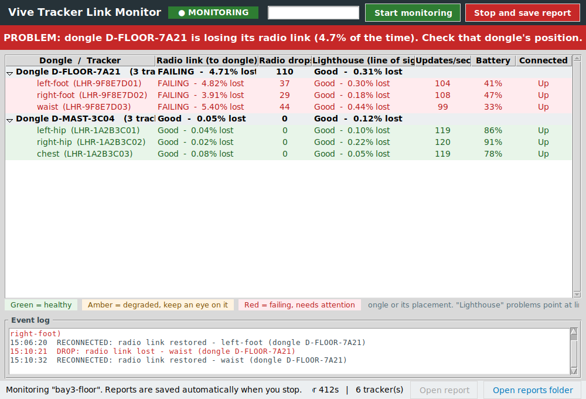
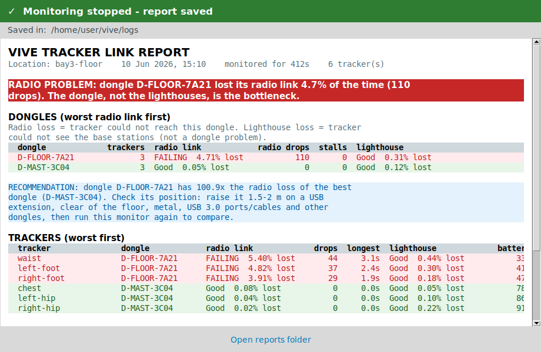

# How to use the Vive Tracker Link Monitor

A short, step-by-step guide for running a diagnostic session and reading the
results. For the why and the measurement method, see the main
[README](../README.md).

The tool answers one question while your trackers are running: **is anything
wrong with the radio (dongle) or optical (lighthouse) link right now, and which
dongle is to blame?**

---

## Before you start

- **Windows PC** with **SteamVR installed**.
- **SteamVR running and active** (headset detected, or a Null/headless driver
  enabled). The app attaches to SteamVR — it does not talk to the trackers
  directly.
- **Trackers powered on** (the actual Vive trackers, not just the headset) and
  their **USB dongles plugged in**.
- No network or extra drivers are needed.

> **If Windows blocks the download** (SmartScreen or Smart App Control): the
> `.exe` is unsigned. Right-click → **Properties** → tick **Unblock** → **OK**,
> or temporarily turn Smart App Control off, then launch it again.

When the app opens, check the **title bar** — it ends with `build <date>` (for
example `build 2026-06-10e`). Use it to confirm you are running the build you
expect.

---

## Step 1 — Launch and enter a location label

Double-click `vive_dongle_gui.exe`. You will see the idle screen:

1. Type a **location label** in the box at the top (for example `bay3-floor`).
   It is used to name the report files so different runs can be compared — it
   is required.
2. Click **Start monitoring** (green, top right).

The status chip turns from `IDLE` to `CONNECTING`, then to `● MONITORING` once
it has attached to SteamVR. If SteamVR is not up yet, the app retries for a few
seconds and then shows a dialog explaining exactly what to fix.

---

## Step 2 — Read the live view

Once running, every tracker appears grouped under the **USB dongle it is paired
with**, with two independent verdicts side by side.

### Everything healthy

- The **banner** is green: *All radio links healthy.*
- Each row shows **Radio link (to dongle)** and **Lighthouse (line of sight)**
  separately, each with the percentage of time lost, plus radio drops, update
  rate, battery and link state.

### A problem appears

Here the three trackers on dongle **D-FLOOR-7A21** are red — **FAILING** radio
links with many drops — while the three on **D-MAST-3C04** stay green. The
banner names the failing dongle, and the **Event log** at the bottom timestamps
every drop and reconnect as it happens.

The colour and side tell you where to look:

| Colour | Meaning |
| ------ | ------- |
| 🟢 Green | Healthy |
| 🟠 Amber | Degraded — keep an eye on it |
| 🔴 Red | Failing — needs attention |

- A problem in the **Radio link** column points at the **dongle** or its
  placement.
- A problem in the **Lighthouse** column points at **line of sight** to the
  base stations.

Let a session run long enough to be representative (move the rig through the
poses/area you care about) before stopping.

---

## Step 3 — Stop and save the report

Click **Stop and save report** (red, top right). The app:

1. Confirms on screen (green banner + a pop-up dialog) that the report was
   saved, and
2. Opens a **summary window** with the full conclusion:

The summary leads with a colour-coded verdict, ranks the **dongles worst radio
link first**, and — when one dongle clearly stands out — gives a concrete
**recommendation** (for example, raise that dongle 1.5–2 m on a USB extension,
clear of the floor, metal and USB 3.0 ports, then re-run to compare).

---

## Where the files go

Everything is written to a `logs\` folder created next to the executable. Use
the **Open report** and **Open reports folder** buttons in the status bar.

| File | What it is |
| ---- | ---------- |
| `<label>_<timestamp>_report.txt` | The same content as the summary window, in plain text. |
| `<label>_<timestamp>_series.csv` | One row per tracker per second — for Excel, pandas or Grafana. |
| `<label>_<timestamp>_events.log` | Every radio drop and reconnect with a full timestamp. |

Naming trackers (optional): after the first run a `tracker_names.csv` template
is created next to the app. Fill in a friendly name per serial and it is shown
automatically on the next run (e.g. `left-foot` instead of `LHR-9F8E7D01`).

---

## Acting on the results

- **One dongle far worse than the rest** → a placement problem on that dongle.
  Raise it on a USB extension, away from the floor, metal, and USB 3.0
  ports/cables, then run again and compare the radio-loss percentages.
- **Radio healthy but lighthouse red/amber** → not a dongle issue; check line
  of sight to the base stations (occlusion, range, reflective surfaces).
- **Everything green** → the links were solid for that session; the saved CSV
  is your baseline for the next comparison.

---

*Screenshots are generated from the live GUI by `tools/make_screenshots.py`.
Re-run it after UI changes to keep this guide in sync.*
